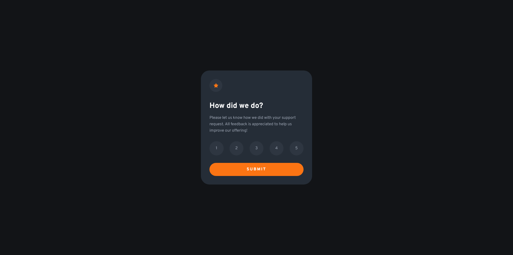

# Frontend Mentor - Interactive rating component solution

This is a solution to the [Interactive rating component challenge on Frontend Mentor](https://www.frontendmentor.io/challenges/interactive-rating-component-koxpeBUmI). Frontend Mentor challenges help you improve your coding skills by building realistic projects.

### Screenshot

### Links

- Solution URL: [Add solution URL here](https://your-solution-url.com)
- Live Site URL: [Add live site URL here](https://your-live-site-url.com)

### Useful resources

- [MDN aria-selected](https://developer.mozilla.org/en-US/docs/Web/Accessibility/ARIA/Attributes/aria-selected)
- [MDN ARIA role radio](https://developer.mozilla.org/en-US/docs/Web/Accessibility/ARIA/Roles/radio_role)

## Author

- Frontend Mentor - [@karolbanat](https://www.frontendmentor.io/profile/karolbanat)
